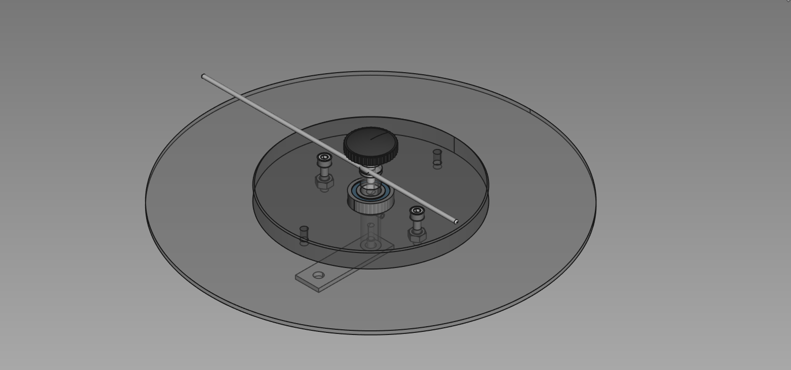
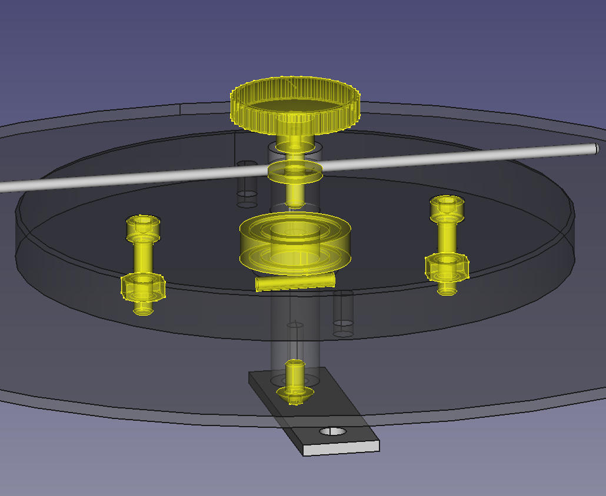
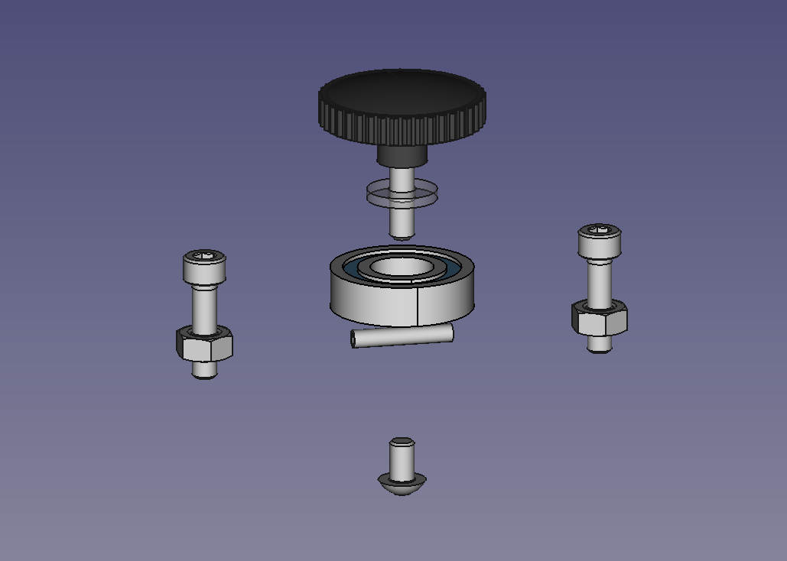
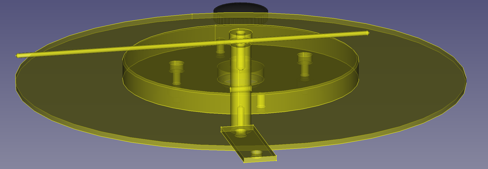

## A Very Good Film Looper

#### CAD Files and materials resources for making your own platter film looper

Parts List: 
1. Parts you buy:
   - R8RS Bearing
   - Retaining Washer
   - Knob
   - Spring Pin
   - M5x10-Screw
   - M5x10-Screw001
   - M5x20-Screw
   - M5x20-Screw001
   - M6-Nut
   - M6-Nut001
   - M5x8-Screw
   - M5x20-ThreadedRod

2. Parts you make:
   - Platter
   - Centre Disk
   - Centre Shaft
   - Standoff
   - Radius Arm Clamp
   - Radius Arm

